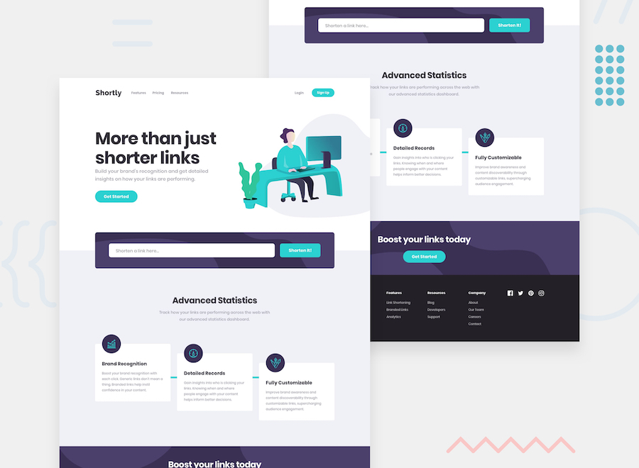

# Frontend Mentor - Shortly URL短縮サービス（実装済コード）

これは [Frontend Mentor の Shortly URL shortening API Challenge](https://www.frontendmentor.io/challenges/url-shortening-api-landing-page-2ce3ob-G) に対する解決策（実装コード）です。

Vercel Serverless Functionsを用いた軽量なAPIモックを実装し、フロントエンド側での例外処理やバリデーション、Clipboard APIを活用したUIインタラクションを組み込んだシングルページWebアプリケーションです。

## 目次

- [概要](#概要)
  - [要件・機能](#要件機能)
  - [スクリーンショット](#スクリーンショット)
  - [リンク](#リンク)
- [開発プロセス](#開発プロセス)
  - [ディレクトリ構造](#ディレクトリ構造)
  - [使用技術・環境](#使用技術環境)
  - [こだわった技術的アプローチ](#こだわった技術的アプローチ)
    - [1. Vercel Serverless Functionsを用いたAPIモックの構築](#1-vercel-serverless-functionsを用いたapiモックの構築)
    - [2. URLコンストラクタを活用したフロントエンド・バリデーション](#2-urlコンストラクタを活用したフロントエンドバリデーション)
    - [3. Fetch API と async/await による非同期通信・例外処理](#3-fetch-api-と-asyncawait-による非同期通信例外処理)
    - [4. イベントデリゲーションと Clipboard API による動的UI制御](#4-イベントデリゲーションと-clipboard-api-による動的ui制御)
    - [5. 流体レスポンシブ（Fluid Design）とSassによるスタイリング管理](#5-流体レスポンシブfluid-designとsassによるスタイリング管理)
- [制作者](#制作者)

## 概要

### 要件・機能

ユーザーは以下の操作・表示確認が可能です：

- **ハンバーガーメニュー:** モバイル環境におけるナビゲーションの開閉制御。
- **URL短縮機能（疑似API連携）:** フォームに入力されたURLをサーバーレス関数（`/api/shorten`）へ非同期リクエストし、生成された短縮URLを動的にレンダリング。
- **例外処理・エラーハンドリング:** 通信エラーや未入力・形式不正を検知し、適切なエラーメッセージを表示。
- **クリップボードコピー:** 動的に追加された結果リストの「Copy」ボタンをクリックすることで、対象URLをクリップボードにコピー。コピー後はボタン表記が「Copied!」に変化し、2秒後に元の状態へ復帰。
- **レスポンシブ対応:** モバイルからデスクトップ（1440px〜）まで、画面幅に応じて縮尺が可変するフルードレイアウト。

### スクリーンショット



### リンク

- ライブサイト（公開ページ）: https://url-shortening-api-landing-page-mu.vercel.app/

---

## 開発プロセス

### ディレクトリ構造

Viteの構成に合わせて不要な初期ファイルを整理し、関心の分離（Separation of Concerns）を意識したディレクトリ構造にしています。ビルド成果物（`dist/`）や依存関係（`node_modules/`）は `.gitignore` にて管理対象外に設定しています。

```text
.
├── .github/
│   └── workflows/
│       └── deploy.yml   # GitHub Actions設定（自動ビルドテスト）
├── .gitignore               # Git管理除外設定
├── README.md                # 本ドキュメント
├── index.html               # メインHTML
├── package.json             # プロジェクト依存関係・各種スクリプト定義
├── package-lock.json        # 依存ライブラリのバージョンロック
├── preview.jpg              # README表示用のプレビュー画像
├── vite.config.js           # Vite設定ファイル
├── api/
│   └── shorten.js           # Vercel Serverless Functions（疑似APIエンドポイント）
├── public/                  # 静的アセット（画像等）
└── src/                     # ソースコード
    ├── main.js              # エントリーポイント
    ├── js/
    │   └── script.js        # DOM操作・バリデーション・API通信
    └── scss/
        └── style.scss       # スタイル定義（SCSS）
```

### 使用技術・環境
- 言語・マークアップ: HTML5 / SCSS (Sass) / Vanilla JS (ES6+)
- リセットCSS: destyle.css (npm管理)
- ビルドツール: Vite
- インフラ: Vercel (ホスティング・Serverless Functions)

### こだわった技術的アプローチ
#### 1. Vercel Serverless Functionsを用いたAPIモックの構築

フロントエンドからのリクエストを受け付けるため、api/shorten.js にNode.js環境のサーバーレス関数を配置しました。不正なHTTPメソッドの拒否（405 Method Not Allowed）や、空データ受信時のバリデーション（400 Bad Request）といった基本的なAPIの作法を考慮しています。Base36を用いたランダム文字列生成により、レスポンス用URLを返す仕組みを実装しました。

#### 2. URLコンストラクタを活用したフロントエンド・バリデーション

無駄な通信リクエストを減らすため、送信前にクライアント側で入力値チェックを行っています。
複雑な正規表現に依存せず、組み込みの new URL(string) コンストラクタを用いた例外判定（try...catch）を活用することで、URLとして成立する形式かどうかを簡潔かつ確実に判定できるようにしています。

#### 3. Fetch API と async/await による非同期通信・例外処理

APIとの通信には async/await 構文を用いた Fetch API を採用しています。ネットワークエラーやサーバー障害などで通信が失敗した場合でもアプリケーションが停止しないよう、全体を try...catch ブロックで囲み、ユーザーにエラー状態を伝えるフィードバックUIを表示する実装にしています。

#### 4. イベントデリゲーションと Clipboard API による動的UI制御

短縮結果は insertAdjacentHTML により動的にリストへ追加されます。生成された各要素に対して個別にイベントリスナーを付与するとメモリ効率が低下するため、親要素（.result）で一括キャッチする「イベントデリゲーション」を採用しました。
また、コピー処理には navigator.clipboard.writeText() を使用し、処理成功時に一時的にボタン表示を変更するタイマー処理（setTimeout）を組み合わせています。

#### 5. 流体レスポンシブ（Fluid Design）とSassによるスタイリング管理

ブレイクポイントごとの唐突なレイアウト変化を抑えるため、vw 単位と固定値を組み合わせた流体レイアウト（Fluid Design）を取り入れました。また、JavaScript側は状態クラスの付与（is-active や is-error など）に留め、見た目の変化やアニメーションはすべてSCSS側で一元管理することで、責務の分離を徹底しています。

## 制作者
GitHub - @yama5504